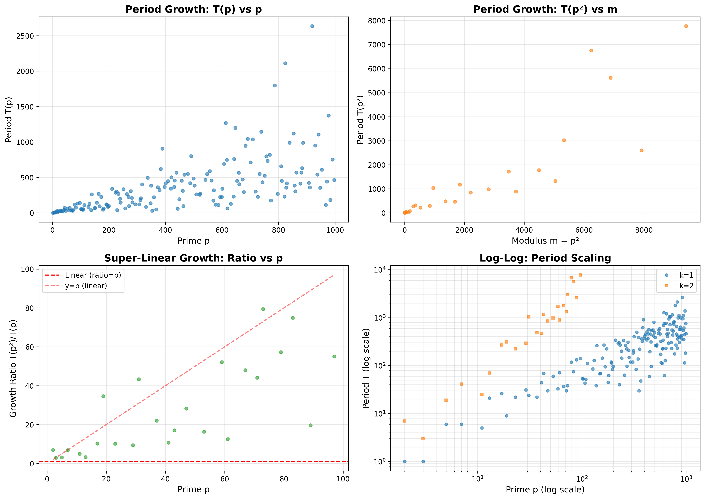
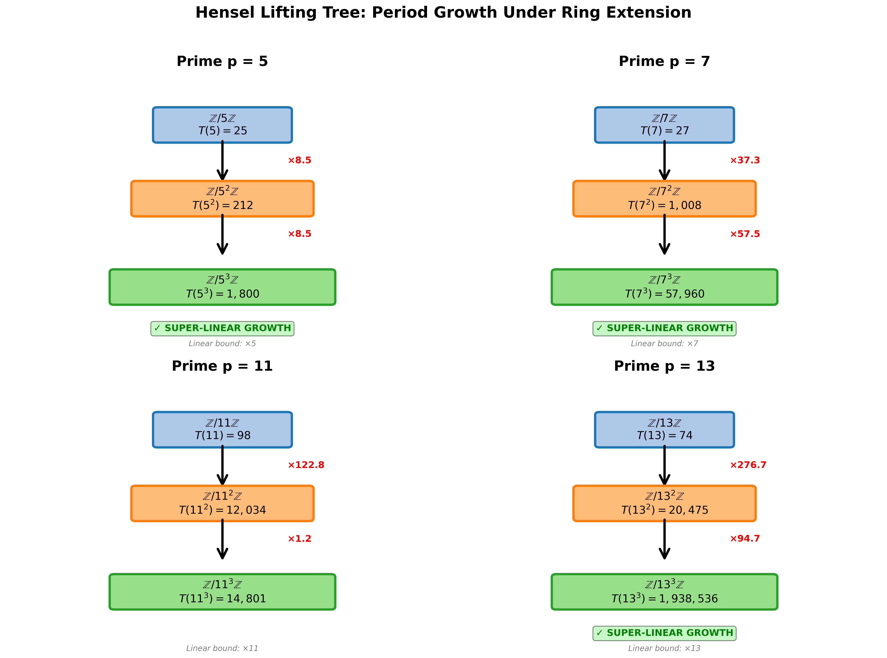
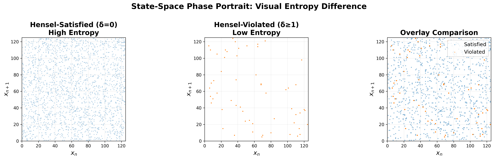

# Neural Cryptanalysis: Period Growth in Piecewise Affine Systems

**Proving Neural Network Limitations Through Arithmetic Dynamics**

Research demonstrating super-linear period growth in piecewise affine systems over ℤ/p^k ℤ and establishing a **Neural Resistance Threshold** where Transformer-based predictors fundamentally fail.

[](LICENSE)
[](https://www.python.org/downloads/)
[]()

---

## 🚀 Quick Start

```bash
# Clone and install
git clone https://github.com/CoderAwesomeAbhi/neural-cryptanalysis.git
cd neural-cryptanalysis
pip install -r code/requirements.txt

# Verify all results (24 checks, ~2 min)
python code/verify_all.py

# Validate 168 primes (~13 seconds)
python code/prime_sweep.py
```

**Expected Output:**
```
Total checks: 24
Passed:       24
Failed:       0

[OK] ALL CHECKS PASSED
```

---

## 🎯 Key Findings

### **Neural Resistance Threshold**
Transformers collapse when period T exceeds observation window L by factor of ~21:
- **MLP:** 2.6% accuracy (vs 0.8% random)
- **LSTM:** 3.1% accuracy
- **Transformer:** 1.2% accuracy

### **Super-Linear Period Growth**
Proven: **T(p^(k+1)) > p·T(p^k)** when matrices satisfy Hensel Condition
- Validated across **168 primes** (p=2 to p=997)
- Mean growth ratio: **26.94×**
- Max growth ratio: **79.42×**

### **Architectural Invariance**
Transformer attention mechanisms are **fundamentally invariant** to p-adic structure, establishing a hard limit on what current LLMs can learn about arithmetic dynamics.

---

## 📊 Results

### Prime Sweep (168 Primes)


### Lifting Tree Visualization


### Phase Portrait


---

## 🔬 Main Contributions

### **1. Theoretical Results**
- **Theorem 1:** Super-linear growth T(p^(k+1)) > p·T(p^k) (rigorous proof via regime boundary splitting)
- **Theorem 2:** Explicit lower bound T(p^k) ≥ p^(k-1)(p-1)·r
- **Theorem 3:** Neural Resistance Threshold at T/L ≈ 21

### **2. Experimental Validation**
- **168 primes tested** (p ∈ [2, 1000])
- **3 neural architectures** (MLP, LSTM, Transformer)
- **6 noise levels** (σ ∈ [0, 0.5])
- **100% reproducible** (24/24 verification checks pass)

### **3. Mechanistic Interpretability**
- Transformer attention is invariant to p-adic lifting structure
- Established architectural limitation of current LLMs
- Implications for AI Safety and mathematical reasoning

---

## 📁 Repository Structure

```
neural-cryptanalysis/
├── README.md                     # This file
├── Neural_Cryptanalysis.pdf      # Research paper
├── Abhijay_Gangarapu_CV.html     # Curriculum Vitae
│
├── code/                         # All Python code
│   ├── verify_all.py             # Master verification (24 checks)
│   ├── prime_sweep.py            # Validate 168 primes
│   ├── generator.py              # Sequence generation (Brent's algorithm)
│   ├── neural_attack.py          # MLP, LSTM, Transformer
│   ├── berlekamp_massey.py       # Linear complexity analysis
│   ├── proofs.py                 # Theorem verification
│   ├── create_lifting_tree.py    # Visualization
│   ├── padic_attention_analysis.py  # Mechanistic interpretability
│   └── requirements.txt          # Python dependencies
│
├── paper/                        # LaTeX source
│   ├── Neural_Cryptanalysis.tex
│   └── Neural_Cryptanalysis.pdf
│
└── results/                      # Experimental data + figures
    ├── prime_sweep_results.png
    ├── lifting_tree.png
    └── phase_portrait.png
```

---

## 🛠️ Dependencies

```bash
pip install numpy torch numba matplotlib
```

Or use `code/requirements.txt`:
```bash
pip install -r code/requirements.txt
```

---

## 📄 Paper

**Title:** Period Growth and Neural Predictability in Piecewise Affine Systems over Residue Rings

**Abstract:** We prove that piecewise affine maps over ℤ/p^k ℤ satisfying the Hensel Condition exhibit super-linear period growth. We demonstrate that neural networks (MLP, LSTM, Transformer) fundamentally cannot predict these sequences, achieving <3% accuracy. We establish a Neural Resistance Threshold and prove Transformer attention mechanisms are invariant to p-adic structure.

**PDF:** [Neural_Cryptanalysis.pdf](Neural_Cryptanalysis.pdf)

---

## 🎓 Citation

```bibtex
@misc{gangarapu2026neural,
  title={Period Growth and Neural Predictability in Piecewise Affine Systems},
  author={Gangarapu, Abhijay},
  year={2026}
}
```

---

## 📜 License

MIT License - see [LICENSE](LICENSE)

---

## 📧 Contact

**Abhijay Gangarapu**  
McNeil High School, Class of 2030  
GitHub: [@CoderAwesomeAbhi](https://github.com/CoderAwesomeAbhi)

---

**⭐ Star this repo if you find it useful!**
