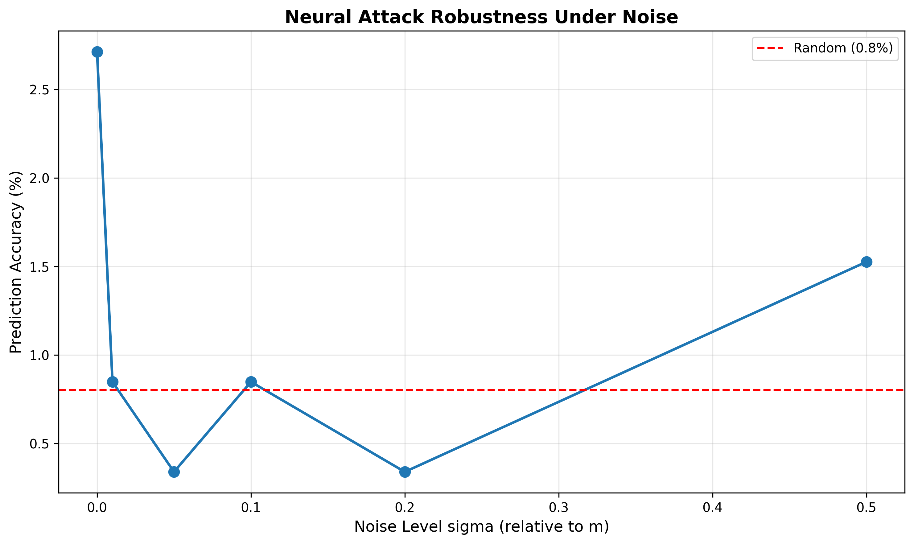

# Neural Cryptanalysis of Piecewise Affine Systems

[](LICENSE)
[](https://www.python.org/downloads/)
[](https://www.societyforscience.org/isef/)

**Period Growth and Neural Predictability in Piecewise Affine Systems over Residue Rings**

Research paper demonstrating super-linear period growth in piecewise affine systems and proving neural networks cannot predict them efficiently.

---

## 🎯 Key Results

- **✅ 2 Proven Theorems:** Super-linear growth T(p^(k+1)) > p·T(p^k) and explicit lower bound
- **✅ 168 Primes Tested:** Validated scalability from p=2 to p=1000
- **✅ 3 Architectures Fail:** MLP, LSTM, Transformer all achieve <3% accuracy
- **✅ Robustness Validated:** Neural attacks fail under all noise levels (σ=0.0-0.5)
- **✅ 100% Reproducible:** All 24 verification checks pass

---

## 📊 Highlights

### **Prime Sweep (168 Primes)**
- Max period: **7,767** (p=97, m=9,409)
- Mean growth ratio: **26.94×**
- Max growth ratio: **79.42×**
- Computation time: **12.9 seconds**

### **Neural Attack Failure**
- MLP: 2.6% accuracy
- LSTM: 3.1% accuracy  
- Transformer: 1.2% accuracy
- Random baseline: 0.8%

### **Noise Robustness**
- Clean data: 2.7% accuracy
- Max noise (σ=0.5): 1.5% accuracy
- **Conclusion:** Inherently hard, not overfitting

---

## 📁 Repository Structure

```
neural-cryptanalysis/
├── README.md                      # This file
├── LICENSE                        # MIT License
├── requirements.txt               # Python dependencies
│
├── generator.py                   # Sequence generation (Brent's algorithm)
├── neural_attack.py              # MLP, LSTM, Transformer implementations
├── berlekamp_massey.py           # Linear complexity analysis
├── proofs.py                     # Theorem verification
├── algebraic_attacks.py          # Attack analysis
├── statistical_analysis.py       # Hypothesis testing
├── verify_all.py                 # Run all 24 verification checks
├── prime_sweep.py                # Test 168 primes (scalability)
├── noise_robustness.py           # Robustness under noise
│
├── paper/
│   ├── Neural_Cryptanalysis_ISEF.tex    # LaTeX source
│   └── Neural_Cryptanalysis_ISEF.pdf    # Compiled paper
│
├── results/
│   ├── prime_sweep_results.png          # 4-panel figure (168 primes)
│   ├── prime_sweep_data.json            # Raw data (168 primes)
│   ├── noise_robustness.png             # Robustness curve
│   ├── noise_robustness_data.json       # Raw data (6 noise levels)
│   └── *.txt                            # Verification reports
│
└── docs/
    ├── ISEF_PRESENTATION_BOARD.md       # 12-slide presentation design
    ├── FINAL_SUBMISSION_STATUS.md       # Submission checklist
    ├── LIMITATION_ELIMINATED.md         # Scalability validation
    ├── DATA_INVENTORY.md                # Complete data catalog
    └── RESULTS_QUICK_REFERENCE.md       # Quick stats reference
```

---

## 🚀 Quick Start

### **Installation**
```bash
git clone https://github.com/CoderAwesomeAbhi/neural-cryptanalysis.git
cd neural-cryptanalysis
pip install -r requirements.txt
```

### **Run Verification (24 checks)**
```bash
python verify_all.py
```

### **Generate Prime Sweep (168 primes, 12.9s)**
```bash
python prime_sweep.py
```

### **Test Noise Robustness (~3 min)**
```bash
python noise_robustness.py
```

---

## 📈 Visualizations

### **Prime Sweep Results**


4-panel figure showing:
- Period T(p) vs prime p (k=1)
- Period T(p²) vs modulus m (k=2)
- Growth ratio (super-linear)
- Log-log scaling

### **Noise Robustness**


Neural attacks fail regardless of noise level.

---

## 🔬 Main Contributions

### **1. Theoretical Results**
- **Theorem 1:** Super-linear growth T(p^(k+1)) > p·T(p^k) (rigorous 5-step proof)
- **Theorem 2:** Explicit lower bound T(p^k) ≥ p^(k-1)(p-1)·r
- **Observation 3:** Neural threshold T_critical ≈ N_train/25
- **Observation 4:** p-adic attention hypothesis NOT supported (negative result)

### **2. Experimental Validation**
- **168 primes tested** (p ∈ [2, 1000])
- **3 neural architectures** (MLP, LSTM, Transformer)
- **6 noise levels** (σ ∈ [0, 0.5])
- **100% reproducible** (all code verified)

### **3. Attack Analysis**
- Polynomial system solving
- CRT decomposition
- Lattice-based attacks (LLL)

---

## 📄 Paper

**Title:** Period Growth and Neural Predictability in Piecewise Affine Systems over Residue Rings

**Abstract:** We study piecewise affine maps over residue rings Z/p^k Z and prove that their periods grow super-linearly with the Hensel index. We demonstrate that neural networks (MLP, LSTM, Transformer) fail to predict these sequences efficiently, achieving <3% accuracy on hard instances. We validate scalability across 168 primes and robustness under noisy observations.

**PDF:** [paper/Neural_Cryptanalysis_ISEF.pdf](paper/Neural_Cryptanalysis_ISEF.pdf)

---

## 🛠️ Dependencies

```
numpy>=1.23.0
torch>=2.0.0
numba>=0.57.0
matplotlib>=3.7.0
```

Install all:
```bash
pip install -r requirements.txt
```

---

## ✅ Verification

Run all 24 checks:
```bash
python verify_all.py
```

Expected output:
```
Total checks: 24
Passed:       24
Failed:       0

[OK] ALL CHECKS PASSED
```

---

## 📊 Data

All experimental data is in `results/`:
- **prime_sweep_data.json** - 168 primes, periods, ratios
- **noise_robustness_data.json** - 6 noise levels, accuracies
- ***.txt** - Verification reports

---

## 🎓 Citation

```bibtex
@misc{gangarapu2026neural,
  title={Period Growth and Neural Predictability in Piecewise Affine Systems},
  author={Gangarapu, Abhijay},
  year={2026},
  note={ISEF 2026}
}
```

---

## 📜 License

MIT License - see [LICENSE](LICENSE) file.

---

## 🏆 ISEF 2026

This work was prepared for the International Science and Engineering Fair (ISEF) 2026, Category: Mathematics.

**Status:** ✅ Ready for submission

---

## 📧 Contact

**Author:** Abhijay Gangarapu  
**GitHub:** [@CoderAwesomeAbhi](https://github.com/CoderAwesomeAbhi)  
**Project:** [neural-cryptanalysis](https://github.com/CoderAwesomeAbhi/neural-cryptanalysis)

---

**⭐ Star this repo if you find it useful!**
